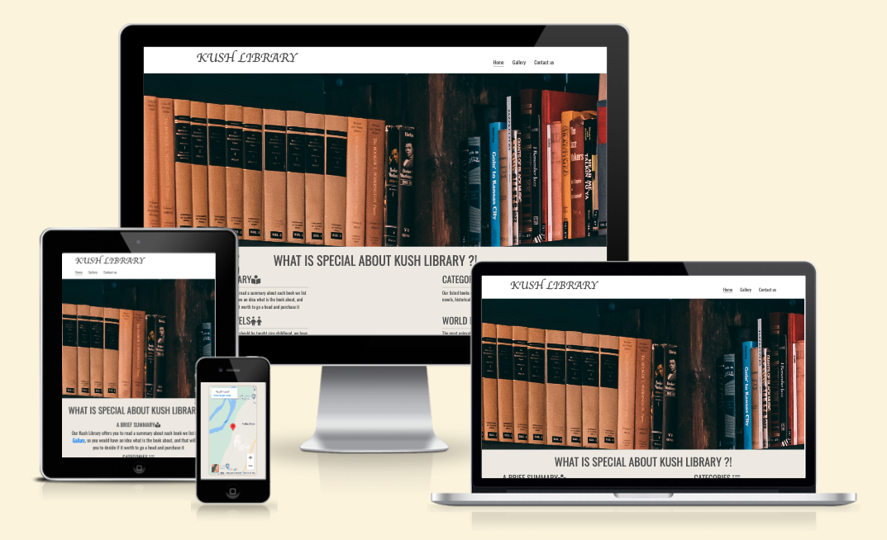
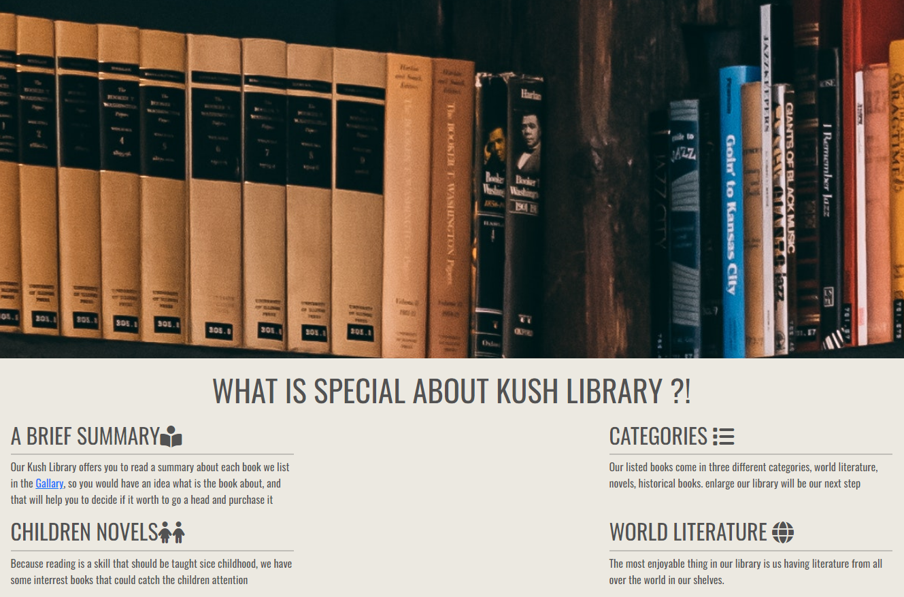
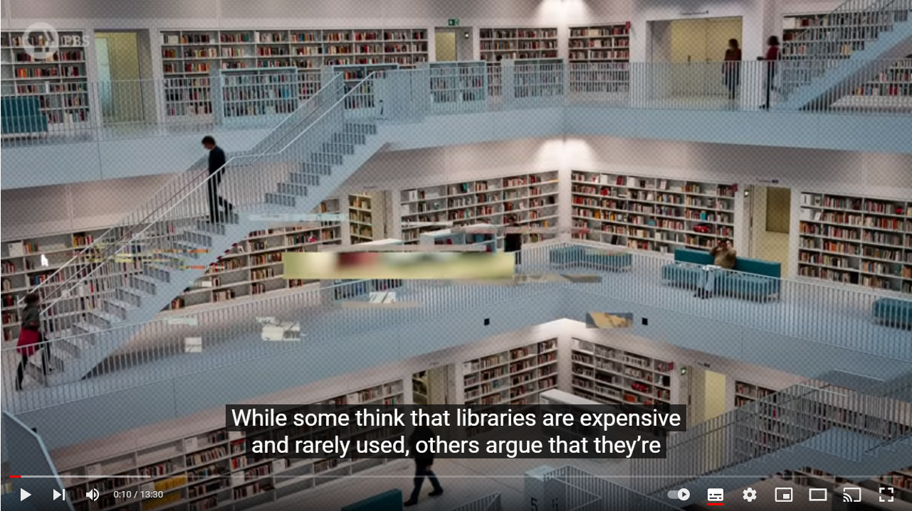
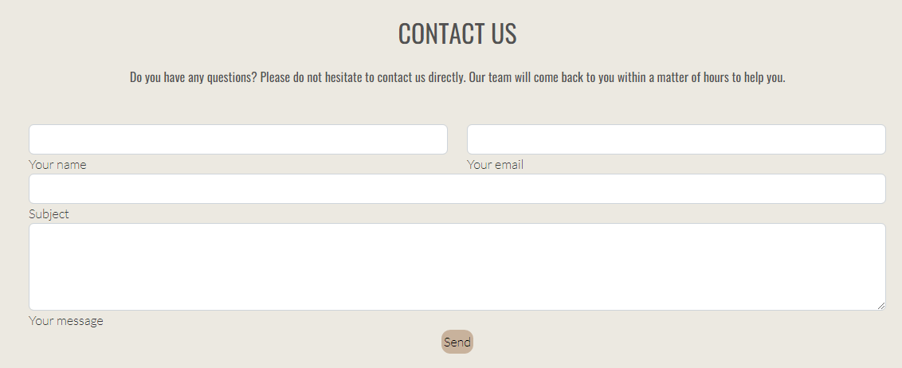

# Kush Library

[Click this link to view the Website.](https://nazek-altayeb.github.io/kush-library/)

Our Website is for people who love reading, it gives the ability to read a brief summary of each book,
Kush Library contains novels, world literatures, history and children books. 
The name of the library (Kush) is taken from a civilization that 
exists thousands of years ago in El-bijrawia area in Sudan Republic, 
the following link helps o learn more about the civilization in 
El-bijrawia In Meroe city: https://en.wikipedia.org/wiki/Pyramids_of_Mero%C3%AB.

With the use of our website, you be able to:
* Read a brief summary of each book, and figure what the book cover looks like.
* Watch a video which will take you through the history of libraries.
  and the most famous ones before thousands of years ago.
* Find our location on site.
* Send us queries or comments.

# User Experience (UX)
 ## Design
- ### Colour Scheme
   The two basic colors are 'Medium light shade of orange' and 'Light grayish orange'.
- ### Typography
   The main font is Oswald and the sans-serif font is used as fallback incase Oswald is not supported by browser.

# Features
 
### Bars
Two Navigation bars, the header and the footer
* The header consists of links to the following ( Home Page, Gallery page, Contact us page),
  besides the Logo of the website.
* The footer consists of links to four social media platforms (Facebook, Youtube, Twitter, Instagram).
    

### The "landing page" image and the "About" section
* it's a image that zoom in once loading the home page, it shows some books on shelves.
* The (About Section) describes the values that our library can adds, also what kind of books do we offer.

### Importance of the Library Section
- An interesting video that take the user through the history of libraries. 

### Visit us section
- it provides the user with a location map, where our library exists.
### The Gallery Page
- This page lists our different books, each book comes with it's cover image and a brief desription
### Contact us Form
- This feature is basically to let the user leave us a comment
- or write some queries that could come up in the costomer's mind.

    
# Testing
* The Pages (Home, Gallery, Contact Us) have been examined with the use of [W3C Markup Validator](https://jigsaw.w3.org/css-validator/#validate_by_input) to make sure no syntax error is there.
* The performance of same pages have been validated by lighthouse (dev tools validator).
* Style sheet is validated by using the [W3C CSS Validator](https://jigsaw.w3.org/css-validator/#validate_by_input).

### Testing User Stories from User Experience (UX)

-  User wants to easily figure out what is the main purpose of the site .

    * When launching the main page, zoom in image of shelves full of books lands in, besides a navigation bar in the top of the page indicates what else is in the website.
    * The user has the ability to watch video expressing the history of libraries, also the location map below helps the use to locate us on site. 

-  User wants to be able to easily be able to navigate throughout the site to find content.

    * The site provides two navigation bars, clearly declare where each link ends, the Header and the Footer for the three pages is the same.
    * The Header navbar navigates between the Gallery and Contact us Pages besides the Home Page, the footer is designed to navigate between four social media portals.
    * On the Contact Us Page, after a form response is submitted, the page refreshes and the user is brought to the top of the page where the navigation bar is.

### Further Testing
-   The website was viewed on a variety of devices such as Desktop, Laptop, iPhone7, iPhone 8 & iPhoneX ...etc.
-   A large amount of testing was done to ensure that all pages were linking correctly.
-   Colleagues  were asked to review the site and documentation to point out any bugs and/or user experience issues.

### Fixed Bugs
- Space between sections in the Home page breaks in small devices, problem was fixed after adding bootstrap class 'container-fluid' in each section.
- Cards in the Gallery page were not looking the same, this is fixed later by the use of twelve column system and some css custom classes. 

# Deployment

## GitHub Pages

The project was deployed to GitHub Pages using the following steps...

1. Log in to GitHub and locate the [GitHub Repository](https://github.com/)
2. At the top of the Repository (not top of page), locate the "Settings" Button on the menu.
    - Alternatively Click [Here](https://raw.githubusercontent.com/) for a GIF demonstrating the process starting from Step 2.
3. Scroll down the Settings page until you locate the "GitHub Pages" Section.
4. Under "Source", click the dropdown called "None" and select "Main Branch".
5. The page will automatically refresh.
6. Scroll back down through the page to locate the now published site [link](https://github.com) in the "GitHub Pages" section.

## Making a Local Clone

1. Log in to GitHub and locate the [GitHub Repository](https://github.com/Nazek-Altayeb/kush-library)
2. Under the repository name, click "Clone or download".
3. To clone the repository using HTTPS, under "Clone with HTTPS", copy the link.
4. Open Git Bash
5. Change the current working directory to the location where you want the cloned directory to be made.
6. Type `git clone`, and then paste the URL you copied in Step 3.

# Technologies
## Languages
1.   [HTML5](https://en.wikipedia.org/wiki/HTML5)
2.   [CSS3](https://en.wikipedia.org/wiki/Cascading_Style_Sheets)

## Frameworks, Libraries and tools

1. [Bootstrap 5:](https://getbootstrap.com/docs/5.2/getting-started/introduction/)
    - Bootstrap was used to assist with the responsiveness and styling of the website.
1. [Hover.css:](https://ianlunn.github.io/Hover/)
    - Hover.css was used on the Social Media icons in the footer to add the float transition while being hovered over.
    - It was also used on the send button in the Contact form inorder to add motion when mouse comes over the send button.
1. [Font Awesome:](https://fontawesome.com/)
    - Font Awesome was used on all pages throughout the website to add icons for aesthetic and UX purposes.
1. [GitHub:](https://github.com/)
    - GitHub is used to store the projects code after being pushed from Git.

# Credit
### Code
- Landing page image style:  [Code institute learning programe](https://learn.codeinstitute.net/courses/course-v1:CodeInstitute+LR101+2021_T1/courseware/4a07c57382724cfda5834497317f24d5/6fd29d155c3b42248ff57bae32978a4b/) 
- [Bootstrap 5](https://getbootstrap.com/docs/5.2/getting-started/introduction/): Bootstrap Library used throughout the project mainly to make site responsive using the Bootstrap Grid System.

###  Content
  - The content (books images and brief summary) in the Gallery page have been taken from the following links:
    1.   https://www.thalia.de/
    1.   https://www.oberlo.com/blog/must-read-books-of-all-time
    1.   https://en.wikipedia.org/wiki/Genghis_Khan_and_the_Making_of_the_Modern_World
    1.   https://en.wikipedia.org/wiki/Cry,_the_Beloved_Country

  -  The landing Page image style (Zoom in feature) has been taken for the "Love Running Project" that is availabe in Code Institute Programme.
  -  Ideas realates to (Organizing and expressing) this Readme file has been taken from  Code Institute readme 

###  Media
 
 - Home page image has been taken from :  https://www.pexels.com/
 - Home page video has been loaded from a youtube channel : PBS Origins

### Acknowledgements

-   My Mentor for continuous helpful feedback.

-   Tutor support at Code Institute for their support.