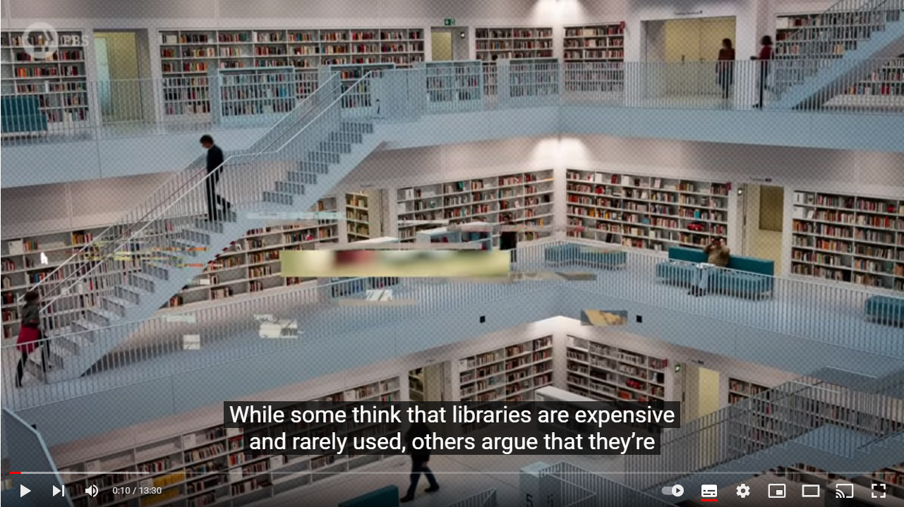

# Kush Library

A website of books with a wide range topics, 
like novels, world literatures, history and chilren books. 
The name of the library (Kush) is the name of a civilization that 
exists thousands of years ago in El-bijrawia area in Sudan Republic, 
the following link helps o learn more about the civilization in 
El-bijrawia In Meroe city: https://en.wikipedia.org/wiki/Pyramids_of_Mero%C3%AB.

With the use of our website, you be able to:
* Read a brief summary of each book, and figure what the book cover looks like.
* Watch a video which will take you through the history of libraries.
  and the most famous ones before thousands of years ago.
* Find our location on site.
* Send us queries or comments.

# Features
 
### Bars
Two Navigation bars, the header and the footer
* The header consists of links to the following ( Home Page, Gallery page, Contact us page),
  besides the Logo of the website.
* The footer consists of links to four social media platforms (Facebook, Youtube, Twitter, Instagram).
    

### The "landing page" image and the "About" section
* it's a image that zoom in once loading the home page, it shows some books on shelves.
* The (About Section) describes the values that our library can adds, also what kind of books do we offer.

### Importance of the Library Section
    An interesting video that take the user through the history of libraries. 
<!--  -->

### Visit us section
    it provides the user with a location map, where our library exists.
### The Gallery Page
    This page lists our different books, each book comes with an image and a brief desription
### Contact us Form
    This feature is basically to let the user leave us a comment
    or write some queries that could come up in the costomer's mind.

    
# Testing
* The Pages (Home, Gallery, Contact Us) have been examined with the use of W3C Validator, 
  the test passed with no warning or errors.
* The same pages have passed the performance test of lighthouse (dev tools validator)
* Style sheet is validated with success by using the Jigsaw.

# Deployment
#### The following is the deployment link of the "Kush Library" website :
        https://nazek-altayeb.github.io/kush-library/
# Technologies
* Bootstrap 5
* CSS
* HTML5

# Credit
## Content
#### The content (books images and brief summary) in the Gallery page have been taken from the following links:
######  https://www.thalia.de/
######   https://www.oberlo.com/blog/must-read-books-of-all-time
######   https://en.wikipedia.org/wiki/Genghis_Khan_and_the_Making_of_the_Modern_World
######   https://en.wikipedia.org/wiki/Cry,_the_Beloved_Country
#### The landing Page image style (Zoom in feature) has been taken for the "Love Running Project" that is availabe in Code Institute Programme

## Media
 
 * Home page image has been taken from :  https://www.pexels.com/
 * Home page video has been loaded from a youtube channel : PBS Origins
